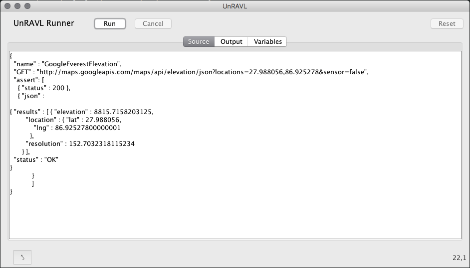
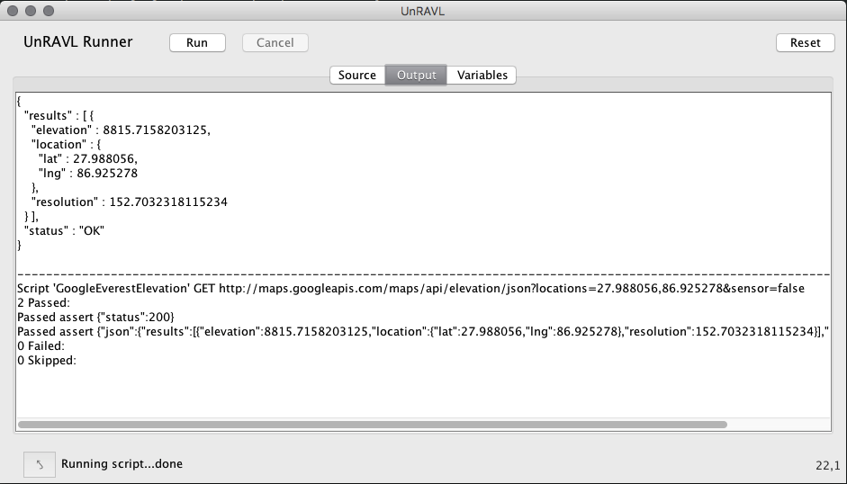
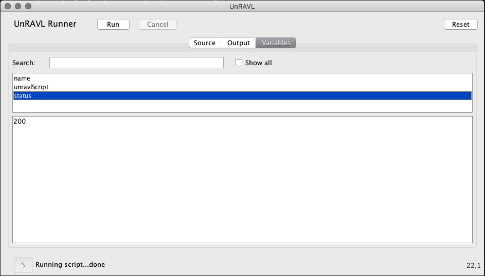

# Interactive mode

UnRAVL also has a basic user interface which allows you
to interactively submit UnRAVL scripts and see the results.

Start UnRAVL in interactive mode with the `-ui` command line
option:

Linux and Mac OS X:
```
unravl.sh -ui
```
Windows:
```
unravl.bat -ui
```

This will display an UnRAVL interface similar to the following.

There are three tabs in the interface: Source, Output, and Variables.

## Source

In this Source tab,
you can enter an UnRAVL script using JSON notation.
The interface does basic JSON syntax checking as you type,
highlighting errors. Click the arrow button at the bottom
left to move the cursor to the first syntax error.



UnRAVL automatically saves the source and restores
it the next time you start the application.
Future enhancements will add the normal *File -> Open*,
*File -> Save* and *File -> Save* as menu operations.

If the JSON is valid, the *Run* button will be enabled.
Click the *Run button to
submit the UnRAVL script from the source pane.
The interface will  automatically switch to the Output tab where you
can see the results of running the script.

## Output

The *Output* tab shows the standard output and standard error
captured while running the script.


For example, the output of any [Bind](../Bind.md) elements
will appear hear. For example, if the script contains

```JSON
  "bind" : { "json" : "@-" }
```
the output from the REST API call will be printed to
the Output tab.

## Variables

You may also select the *Variables* tab to view UnRAVL
variables. Click on a variable name to see its
value in the bottom of the *Variables* tab.



UnRAVL interface will pretty-print JSON objects
and arrays for variabels that have JSON values
(but not simple string values, even if they contain
JSON text.)


If you uncheck the *Show all* checkbox, the variables
list will show only variables that were bound or
modified when the UnRAVL script executed.

You can also type in a search string and only variables
whose names contain the search text will be shown.
Clear the search box to remove the filtering.

